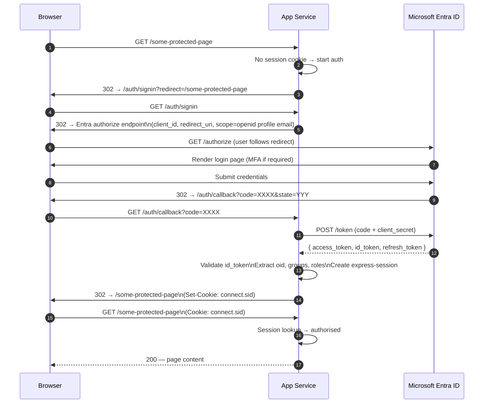

# Authentication Flow

The dashboard uses the **Microsoft Entra ID authorization-code flow** (MSAL) for browser-based users. Administrative and internal API calls use a shared HMAC secret or managed-identity credentials.

---

## Browser auth (OIDC authorization-code flow)

---

## Authorisation levels

Once authenticated, routes are gated by three roles derived from Entra group membership:

| Level | Middleware | Who |
|---|---|---|
| **Public** | none | Anyone, including unauthenticated callers |
| **User** | `requireAuth` | Any authenticated Entra user in the tenant |
| **Admin** | `requireAdmin` | Members of the configured admin Entra group |
| **Internal** | `INGEST_API_KEY` HMAC | Worker-to-API calls with shared secret header |

Routes are documented in [API Reference → Auth levels](../reference/api.md#auth-levels).

---

## Session storage

Sessions are stored in **Azure SQL** (`AppSessions` table) using `connect-mssql-v2`.

- Session lifetime: 8 hours (configurable via `SESSION_MAX_AGE_MS`)
- Secret: stored in Key Vault as `capdash-session-secret`; injected as Key Vault reference in App Settings
- Cookie: `httpOnly`, `secure`, `sameSite: lax`

---

## Token handling

| Token | Usage | Stored where |
|---|---|---|
| `id_token` | User identity, group claims | Discarded after session creation |
| `access_token` | ARM calls on behalf of user (not used — MI preferred) | Not stored |
| `refresh_token` | Kept for silent renewal | Encrypted in session row |

!!! warning
    Access tokens are never written to `localStorage` or `sessionStorage`. Session state lives server-side in SQL.
