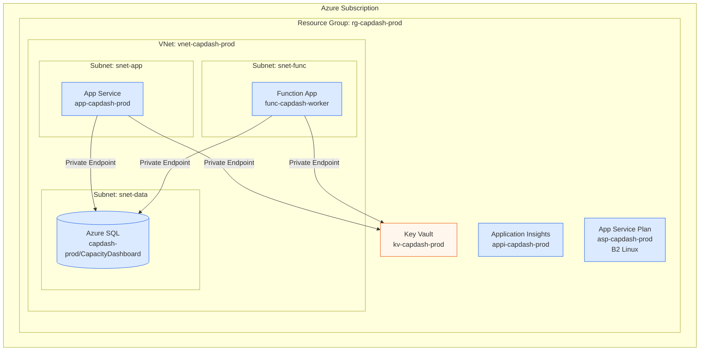
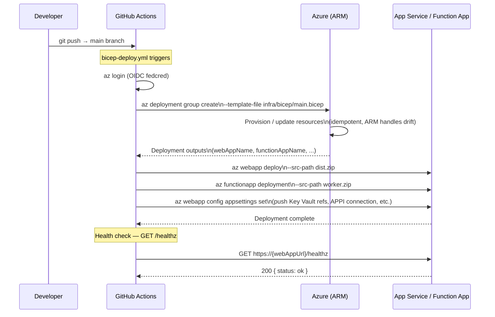

# Deployment Topology

---

## Azure resource topology

---

## CI/CD pipeline

---

## Environments

| Environment | Branch | Infra | Bicep parameter file |
|---|---|---|---|
| `production` | `main` | `rg-capdash-prod` | `infra/bicep/params/prod.bicepparam` |

!!! info
    A staging environment is not yet provisioned. PRs run Bicep `what-if` only.
