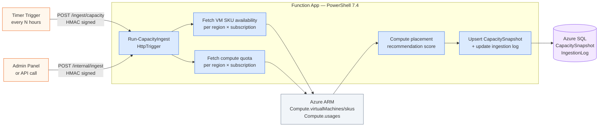
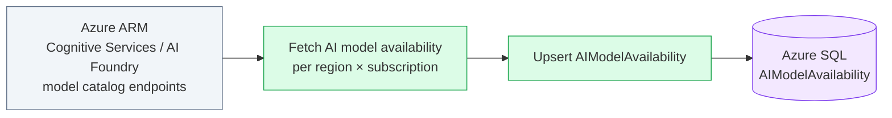

# Ingestion Pipeline

The ingestion pipeline pulls live Azure capacity and quota data from ARM and stores it in Azure SQL. It runs on a schedule and can be triggered on demand via the Admin panel.

---

## Pipeline architecture



---

## AI model catalog ingestion

A separate pipeline ingests Azure OpenAI and AI Foundry model availability.



---

## Ingestion schedule

| Dataset | Default schedule | Configurable via |
|---|---|---|
| VM capacity snapshots | Every 6 hours | `INGEST_INTERVAL_HOURS` env var |
| AI model catalog | Once per day | `AI_INGEST_INTERVAL_HOURS` env var |
| Live placement (on-demand) | Per user request | No schedule — triggered per call |

---

## Triggering ingestion manually

From the Admin panel → **Ingestion** → **Run Now**.

Or via the internal API (requires `INGEST_API_KEY`):

```bash
curl -X POST https://<host>/internal/ingest/capacity \
  -H "x-ingest-api-key: <INGEST_API_KEY>"
```

---

## Data freshness

The `CapacitySnapshot` table stores one row per `(subscriptionId, region, vmSku)`. Each row has a `snapshotTime` column. The UI displays the most recent snapshot time in the filter bar.

!!! tip
    If capacity data looks stale, check the **Ingestion Log** in the Admin panel for recent run status and error details.
