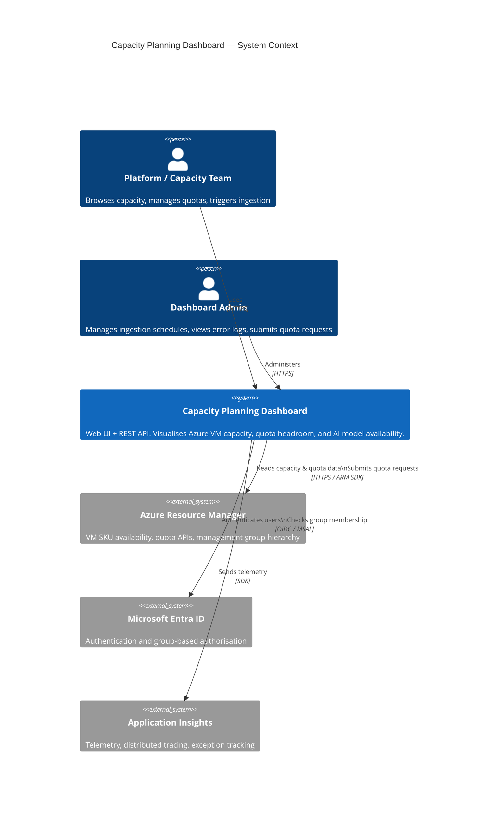
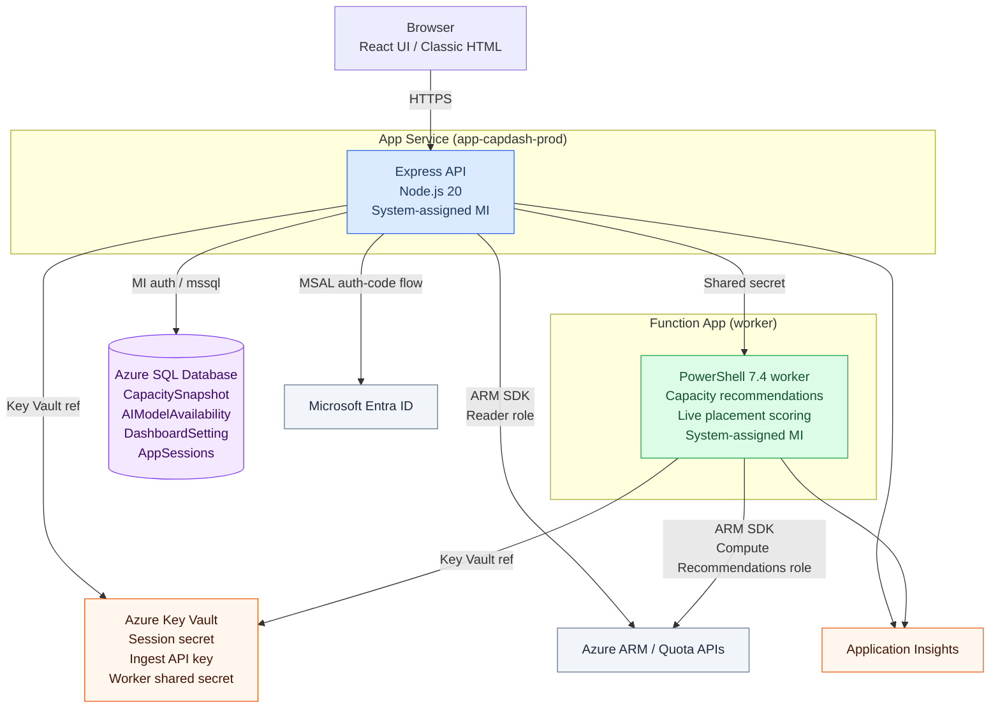
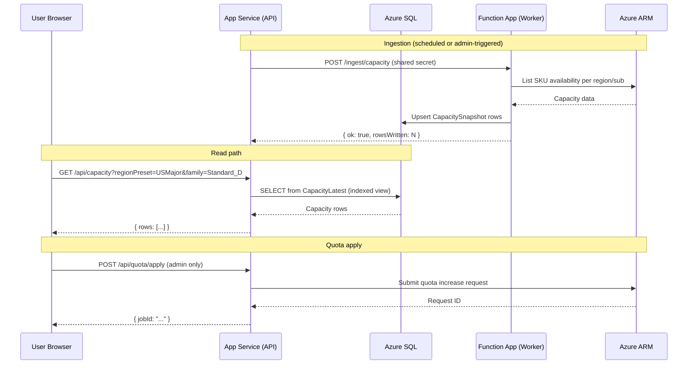

# Architecture Overview

The dashboard is a three-tier Node.js web application backed by Azure SQL, with a PowerShell Azure Functions worker for compute-intensive ARM calls.

---

## System Context (C4 Level 1)

Who uses the system and what external services does it depend on.

---

## Container Diagram (C4 Level 2)

The internal components and how they connect.

---

## Data flow summary

