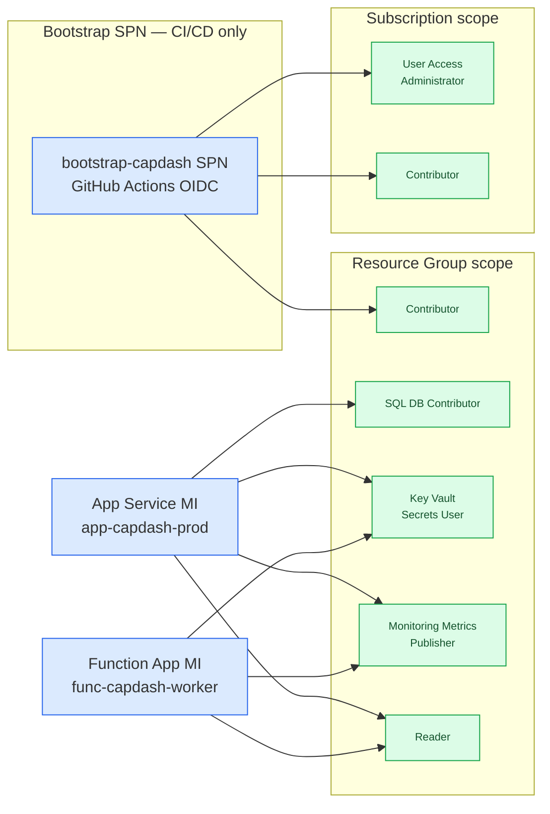

# RBAC Topology

Two **system-assigned managed identities** are used — one for the App Service and one for the Function App. Both are granted least-privilege roles at appropriate scopes.

---

## Role assignment map

---

## Managed identity authentication

The App Service and Function App both use **system-assigned managed identities** for all Azure service authentication. No connection strings, no stored credentials.

| Service | Auth type | MI |
|---|---|---|
| Azure SQL | `azure-active-directory-msi-app-service` | App Service MI |
| Key Vault | MI credential via `@azure/identity` DefaultAzureCredential | App Service MI |
| ARM (read) | MI credential | App Service MI |
| Key Vault | MI credential | Function App MI |
| ARM (read + recommendations) | MI credential | Function App MI |

---

## Bootstrap SPN (CI/CD only)

The `bootstrap-capdash` SPN is used only by GitHub Actions for infrastructure deployment. It is **never used at runtime**.

OIDC federated credentials are configured for three subjects:

| Subject | Used by |
|---|---|
| `ref:refs/heads/main` | Pushes to main branch |
| `pull_request` | PR validation workflows |
| `repo:{org}/{repo}:environment:production` | The `bicep-deploy.yml` `environment: production` job |

The bootstrap SPN requires elevated roles (`User Access Administrator` at subscription) to deploy RBAC role assignments via Bicep. This is scoped to the minimum needed.

!!! tip
    The bootstrap script (`scripts/bootstrap-github-oidc.ps1`) handles SPN creation, role grants, and federated credential configuration automatically. See [Bootstrap Guide](../deployment/bootstrap.md).
