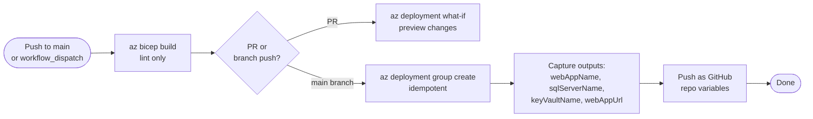

# Bicep Deploy

The `bicep-deploy.yml` GitHub Actions workflow is the single path for all Azure infrastructure changes. It runs on every push to `main` that touches `infra/` and on `workflow_dispatch`.

---

## Workflow overview



---

## Trigger conditions

| Trigger | What happens |
|---|---|
| Push to `main`, paths `infra/**` | Full deploy |
| Push to `main`, path `.github/workflows/bicep-deploy.yml` | Full deploy |
| `workflow_dispatch` | Full deploy (manual) |

!!! note "Concurrency safety"
    The workflow uses `cancel-in-progress: false` — concurrent runs are queued, never cancelled. Cancelling a Bicep deployment mid-run can leave resources in a partially-provisioned state.

---

## OIDC authentication

The workflow authenticates to Azure using OIDC federated credentials (no stored secrets):

```yaml
- uses: azure/login@v2
  with:
    client-id: ${{ vars.AZURE_CLIENT_ID }}
    tenant-id: ${{ vars.AZURE_TENANT_ID }}
    subscription-id: ${{ vars.AZURE_SUBSCRIPTION_ID }}
```

These variables are populated automatically by the [bootstrap script](bootstrap.md).

---

## Bicep parameter file

The deploy uses:

```
infra/bicep/params/prod.bicepparam
```

Key parameters set there:

| Parameter | Purpose |
|---|---|
| `environmentName` | Resource naming suffix (e.g., `prod`) |
| `sqlAdminLogin` | SQL admin login (bootstrap only, MI takes over at runtime) |
| `entraClientId` | App registration client ID for Entra auth |
| `entraAdminGroupId` | Entra group whose members get Admin access in the dashboard |
| `quotaManagementGroupId` | Root management group ID for quota discovery |

---

## Deployed resource outputs

After a successful deploy, these are captured and pushed as GitHub repo variables:

| Variable | Value |
|---|---|
| `WEBAPP_NAME` | App Service name |
| `SQL_SERVER_NAME` | Azure SQL server hostname |
| `SQL_DATABASE_NAME` | Database name |
| `KEY_VAULT_NAME` | Key Vault name |
| `WEBAPP_URL` | App Service URL |

---

## Modifying infrastructure

1. Edit files under `infra/bicep/`
2. Open a PR — the workflow runs `what-if` and comments the plan
3. Merge to `main` — full deploy runs automatically

!!! warning "Role assignments in Bicep"
    Bicep modules under `infra/bicep/modules/rbac/` create Azure role assignments. The bootstrap SPN requires `User Access Administrator` at subscription scope to deploy these. If the deploy fails with `AuthorizationFailed` on a `roleAssignments` resource, verify the bootstrap SPN has the correct role.
