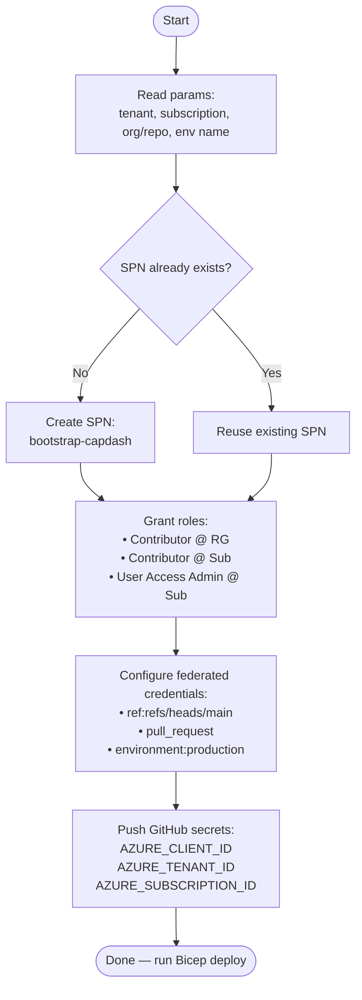

# Bootstrap Guide

The bootstrap script creates the **GitHub Actions SPN**, configures **OIDC federated credentials**, and **pushes secrets to GitHub** — so CI/CD can authenticate to Azure without stored passwords.

Run this once before the first Bicep deployment.

---

## What the script does



---

## Prerequisites

- Azure CLI installed and logged in as an account with **Owner** or **User Access Administrator** at subscription scope
- `gh` CLI installed and authenticated (`gh auth login`)
- Repository name known (org/repo format)

---

## Running the script

```powershell
cd scripts

.\bootstrap-github-oidc.ps1 `
  -TenantId        "<your-entra-tenant-id>" `
  -SubscriptionId  "<your-azure-subscription-id>" `
  -ResourceGroup   "rg-capdash-prod" `
  -GitHubOrg       "IBuySpy-Dev" `
  -GitHubRepo      "Capacity-Planning-Dashboard" `
  -EnvironmentName "production"
```

All parameters are required. The script is **idempotent** — re-running it updates credentials without duplicating resources.

---

## Expected output

```text
[+] SPN: bootstrap-capdash  (appId: xxxxxxxx-...)
[+] Role: Contributor @ /subscriptions/<id>/resourceGroups/rg-capdash-prod
[+] Role: Contributor @ /subscriptions/<id>
[+] Role: User Access Administrator @ /subscriptions/<id>
[+] FedCred: ref:refs/heads/main
[+] FedCred: pull_request
[+] FedCred: repo:IBuySpy-Dev/Capacity-Planning-Dashboard:environment:production
[+] GitHub secret: AZURE_CLIENT_ID
[+] GitHub secret: AZURE_TENANT_ID
[+] GitHub secret: AZURE_SUBSCRIPTION_ID
[✓] Bootstrap complete. Push to main to trigger Bicep deploy.
```

---

## After bootstrap

1. Go to your GitHub repo → **Settings → Environments** → create `production` (matches `EnvironmentName`).
2. Push any commit to `main` to trigger the `bicep-deploy.yml` workflow.
3. Monitor the Actions run — first deploy provisions all Azure resources.

---

## Troubleshooting

| Error | Cause | Fix |
|---|---|---|
| `Insufficient privileges to complete the operation` | Logged-in account lacks UAA role | Log in as Owner or use `az login --allow-no-subscriptions` with a higher-privileged account |
| `FedCred already exists` warning | Idempotent re-run | Safe to ignore — existing credential is retained |
| `gh secret set` fails with 403 | `gh` not authenticated | Run `gh auth login` first |
| `AADSTS70021` in Actions | Federated credential subject mismatch | Check the environment name matches `EnvironmentName` parameter exactly |
