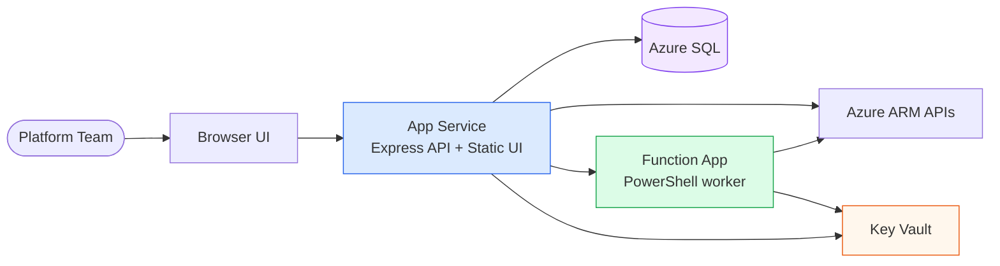

# Capacity Planning Dashboard

**Azure capacity visibility, quota management, and placement scoring for platform teams.**

The Capacity Planning Dashboard gives you a single pane of glass over Azure VM capacity across subscriptions and regions — so you can see where capacity is healthy, where it's constrained, and act on it before your workloads feel the impact.

---

## What it does

| Capability | Description |
|---|---|
| **Capacity Explorer** | Browse VM SKU availability by region, family, and subscription. Filter, sort, and export to Excel. |
| **Quota Workbench** | Discover quota headroom across management groups, simulate increases, and submit quota requests to ARM. |
| **Placement Scoring** | Score candidate VM placements based on live availability. Helps pick regions with the most headroom. |
| **AI Model Catalog** | Track Azure AI model availability and provider quota across regions. |
| **Ingestion Pipeline** | Scheduled ARM data ingestion into SQL — VM capacity, AI quotas, and model catalog. |
| **Admin Panel** | Trigger ingestion, view error logs, inspect SQL objects, and manage UI settings. |

---

## Architecture at a glance

→ Full diagrams in [Architecture](architecture/overview.md)

---

## Quick links

- [Local development setup](getting-started/local-dev.md)
- [Bootstrap & first deployment](deployment/bootstrap.md)
- [Configuration reference](reference/configuration.md)
- [API endpoint reference](reference/api.md)
- [Troubleshooting](operations/troubleshooting.md)
